# 🚀 Microsoft Learn Course Completion Bot

[](https://python.org)
[](https://selenium.dev)
[](https://ai.google.com)
[](LICENSE)

Automate the completion of Microsoft Learn modules using **Selenium** for browser automation and **Google Gemini AI** for solving multiple-choice questions (MCQs). This intelligent script navigates module pages, selects answers, and completes courses hands-free with AI-powered decision making.

---

## 🔥 Key Features

- ✅ **Automated Microsoft Learn Navigation** - Seamlessly navigates through module pages and course content
- ✅ **AI-Powered Question Solving** - Uses Google Gemini AI to intelligently answer multiple-choice questions
- ✅ **Smart Page Interaction** - Automatically scrolls, clicks "Next" & "Finish" buttons, and handles page transitions
- ✅ **Fully Configurable Setup** - Easy configuration with your own Gemini API key and customizable settings
- ✅ **Batch Course Processing** - Handles multiple course modules in a single automated run
- ✅ **Intelligent Error Handling** - Robust error detection and recovery mechanisms
- ✅ **Progress Tracking** - Real-time console output showing completion progress

---

## 📂 Project Structure

```
📁 microsoft-learn-bot/
├── 📄 automate_courses.py    # Main automation script
├── 📖 README.md              # Comprehensive documentation
├── 📋 requirements.txt       # Python dependencies
└── 📁 examples/              # Example configuration files
    └── 📄 sample_links.py    # Sample module links
```

---

## 🛠️ Prerequisites & Installation

### System Requirements

- **Python 3.7+** - Programming language runtime
- **Google Chrome** - Web browser for automation
- **Internet Connection** - Required for API calls and module access
- **Microsoft Learn Account** - Must be logged in before running

### Install Dependencies

```bash
# Clone the repository
git clone https://github.com/yourusername/microsoft-learn-bot.git
cd microsoft-learn-bot

# Install required packages
pip install selenium webdriver-manager google-generativeai

# Or install from requirements.txt
pip install -r requirements.txt
```

### Package Details

| Package | Version | Purpose |
|---------|---------|---------|
| `selenium` | 4.0+ | Browser automation and web scraping |
| `webdriver-manager` | Latest | Automatic Chrome driver management |
| `google-generativeai` | Latest | Google Gemini AI integration |

---

## 🔑 Gemini AI Setup Guide

### Step 1: Create Google AI Project

1. Navigate to [Google AI Studio](https://aistudio.google.com/?utm_source=github)
2. Sign in with your Google account
3. Create a new project or select existing one
4. Go to "Get API Key" section

### Step 2: Generate API Key

1. Click **"Create API Key"**
2. Select your project
3. Copy the generated API key
4. **Keep it secure and private**

### Step 3: Configure the Script

Replace the placeholder in `automate_courses.py`:

```python
import google.generativeai as genai

# 🔧 Configure your Gemini AI API key here
genai.configure(api_key="YOUR_ACTUAL_API_KEY_HERE")
```

> **🔒 Security Note:** Never commit your API key to version control. Consider using environment variables for production use.

---

## ⚙️ How It Works - Detailed Workflow

### 🧠 Core Automation Process

The bot follows an intelligent workflow to complete Microsoft Learn modules:

```mermaid
flowchart TD
    A[🚀 Start Script] --> B[🌐 Open Module Link]
    B --> C[⏳ Wait for Page Load]
    C --> D{🔍 MCQ Found?}
    D -->|Yes| E[📝 Extract Question & Options]
    E --> F[🤖 Query Gemini AI]
    F --> G[✅ Select AI Answer]
    G --> H[📤 Submit Response]
    D -->|No| I[📜 Scroll Page Content]
    H --> I
    I --> J{🏁 Finish Page?}
    J -->|No| K[➡️ Click Next/Continue]
    K --> C
    J -->|Yes| L[✨ Module Complete]
    L --> M{📚 More Modules?}
    M -->|Yes| B
    M -->|No| N[🎉 All Done!]
```



### 🔄 Step-by-Step Process

1. **🌐 Browser Initialization**
   - Launches Chrome browser with optimized settings
   - Configures implicit waits and timeouts
   - Sets up error handling mechanisms

2. **📄 Page Navigation**
   - Loads Microsoft Learn module URLs
   - Handles dynamic content loading
   - Manages session cookies and authentication

3. **🔍 Question Detection**
   - Scans for MCQ elements using CSS selectors
   - Extracts question text and answer options
   - Validates question structure and completeness

4. **🤖 AI Integration**
   - Sends structured prompts to Gemini AI
   - Receives and validates AI responses
   - Implements fallback mechanisms for API failures

5. **✅ Answer Submission**
   - Selects the AI-recommended answer
   - Clicks submit button and waits for response
   - Handles submission confirmations and errors

6. **➡️ Progress Navigation**
   - Identifies and clicks navigation buttons
   - Manages page transitions and loading states
   - Tracks completion progress

---

## 📜 Code Architecture & Implementation

### 1. 🧠 Gemini AI Answer Function

The core AI integration function that processes questions:

```python
def get_gemini_answer(question, options):
    """
    Queries Gemini AI for the best answer to a multiple-choice question.
    
    Args:
        question (str): The question text
        options (list): List of answer options
    
    Returns:
        int: Index of the selected answer (0-based)
    """
    prompt = f"""
    You are an expert at Microsoft Learn technical content.
    
    Question: {question}
    
    Options:
    {chr(10).join([f"{i+1}. {opt}" for i, opt in enumerate(options)])}
    
    Instructions:
    - Analyze the question carefully
    - Consider Microsoft's best practices and documentation
    - Respond with ONLY the number of the correct option (1, 2, 3, ...)
    - Be confident in your technical knowledge
    """
    
    try:
        response = model.generate_content(prompt)
        answer_index = int(response.text.strip()[0]) - 1
        print(f"🤖 Gemini selected option: {answer_index + 1}")
        return answer_index
    except Exception as e:
        print(f"❌ AI Error: {e}. Using fallback option 1")
        return 0  # Fallback to first option
```

### 2. 🔄 Module Processing Engine

The main function that handles individual module completion:

```python
def process_module(url, wait_time=10):
    """
    Processes a single Microsoft Learn module from start to finish.
    
    Args:
        url (str): Module URL to process
        wait_time (int): Initial wait time for page load
    """
    print(f"📂 Processing module: {url}")
    driver.get(url)
    time.sleep(wait_time)

    page_count = 0
    max_pages = 50  # Safety limit

    while page_count < max_pages:
        page_count += 1
        print(f"📄 Processing page {page_count}")

        # 🔍 Scan for quiz questions
        questions = driver.find_elements(By.CSS_SELECTOR, "div.quiz-question")
        
        if questions:
            print(f"❓ Found {len(questions)} question(s)")
            
            for idx, question_element in enumerate(questions):
                try:
                    # Extract question text
                    question_text = question_element.find_element(
                        By.CSS_SELECTOR, "div.field-label p"
                    ).text.strip()
                    
                    # Extract answer options
                    option_elements = question_element.find_elements(
                        By.CSS_SELECTOR, "label.quiz-choice p"
                    )
                    options = [opt.text.strip() for opt in option_elements]
                    
                    print(f"📝 Q{idx+1}: {question_text[:60]}...")
                    
                    # Get AI answer
                    selected_answer = get_gemini_answer(question_text, options)
                    
                    # Click the selected option
                    radio_buttons = question_element.find_elements(
                        By.CSS_SELECTOR, "input.choice-input"
                    )
                    radio_buttons[selected_answer].click()
                    
                    print(f"✅ Selected: {options[selected_answer][:40]}...")
                    
                except Exception as e:
                    print(f"❌ Error processing question {idx+1}: {e}")

        # 📤 Submit answers if submit button exists
        try:
            submit_button = driver.find_element(
                By.CSS_SELECTOR, "button[data-bi-name='module-unit-module-assessment-submit']"
            )
            submit_button.click()
            print("📤 Submitted answers")
            time.sleep(3)  # Wait for submission processing
        except NoSuchElementException:
            print("ℹ️  No submit button found")

        # 🏁 Check if we've reached the completion page
        try:
            finish_element = driver.find_element(
                By.XPATH, "//a[contains(text(),'Go back to finish')]"
            )
            print("🎯 Reached finish page!")
            break
        except NoSuchElementException:
            pass

        # ➡️ Navigate to next page
        try:
            continue_button = driver.find_element(
                By.CSS_SELECTOR, "a[data-bi-name='continue']"
            )
            continue_button.click()
            print("➡️ Moving to next page...")
            time.sleep(2)
        except NoSuchElementException:
            print("🔚 No continue button found - module may be complete")
            break

    print(f"✨ Module processing complete! ({page_count} pages)")
```

### 3. 🚀 Main Execution Controller

The orchestration logic for processing multiple modules:

```python
def main():
    """Main execution function"""
    # 📋 List of Microsoft Learn module URLs
    module_links = [
        "https://learn.microsoft.com/en-us/training/modules/prepare-azure-ai-development/1-introduction",
        "https://learn.microsoft.com/en-us/training/modules/create-manage-azure-cognitive-services/1-introduction",
        # Add more module URLs here
    ]

    print("🚀 Starting Microsoft Learn Course Completion Bot")
    print(f"📚 Processing {len(module_links)} modules")

    for i, link in enumerate(module_links, 1):
        print(f"\n{'='*60}")
        print(f"📖 Module {i}/{len(module_links)}")
        
        # Longer wait for first module (login time)
        wait_time = 100 if i == 1 else 10
        
        try:
            process_module(link, wait_time)
            print(f"✅ Module {i} completed successfully!")
        except Exception as e:
            print(f"❌ Error in module {i}: {e}")
            continue  # Continue with next module

    print("\n🎉 All modules processing complete!")
    driver.quit()

if __name__ == "__main__":
    main()
```

---

## 🚦 Usage Instructions

### Quick Start

1. **📥 Setup the Project**
   ```bash
   git clone https://github.com/yourusername/microsoft-learn-bot.git
   cd microsoft-learn-bot
   pip install -r requirements.txt
   ```

2. **🔑 Configure API Key**
   - Get your Gemini API key from Google AI Studio
   - Replace `YOUR_API_KEY` in the script

3. **📝 Add Your Module URLs**
   ```python
   module_links = [
       "https://learn.microsoft.com/en-us/training/modules/your-module-1/",
       "https://learn.microsoft.com/en-us/training/modules/your-module-2/",
       # Add more URLs...
   ]
   ```

4. **🌐 Login to Microsoft Learn**
   - Open Chrome and login to your Microsoft Learn account
   - Keep the browser session active

5. **▶️ Run the Bot**
   ```bash
   python automate_courses.py
   ```

### Example Console Output

```bash
🚀 Starting Microsoft Learn Course Completion Bot
📚 Processing 3 modules

============================================================
📖 Module 1/3
📂 Processing module: https://learn.microsoft.com/en-us/training/modules/prepare-azure-ai-development/1-introduction
📄 Processing page 1
❓ Found 1 question(s)
📝 Q1: What is the primary purpose of Azure Cognitive Services?...
🤖 Gemini selected option: 2
✅ Selected: To provide pre-built AI models for common tasks...
📤 Submitted answers
➡️ Moving to next page...
📄 Processing page 2
🎯 Reached finish page!
✅ Module 1 completed successfully!

============================================================
📖 Module 2/3
📂 Processing module: https://learn.microsoft.com/en-us/training/modules/create-manage-azure-cognitive-services/1-introduction
...

🎉 All modules processing complete!
```

---

## ⚠️ Important Considerations

### 🛡️ Ethical Usage Guidelines

- **Educational Purpose Only** - Use this tool for learning automation, not to bypass actual learning
- **Compliance** - Ensure you comply with Microsoft Learn's Terms of Service
- **Responsible Use** - Don
